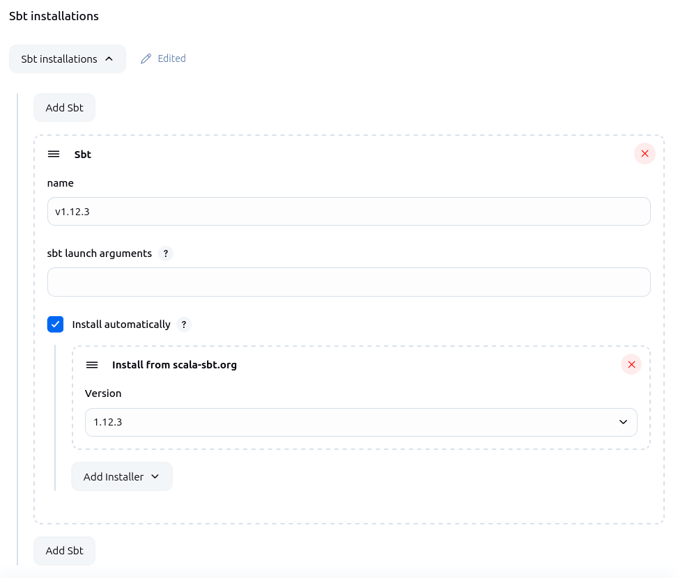
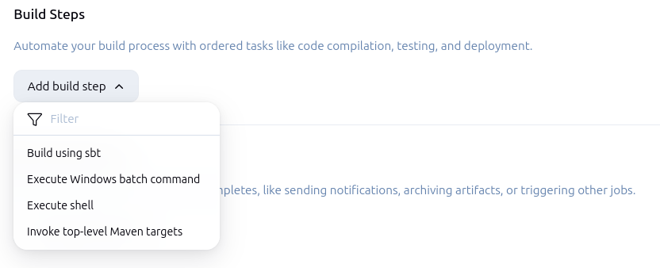
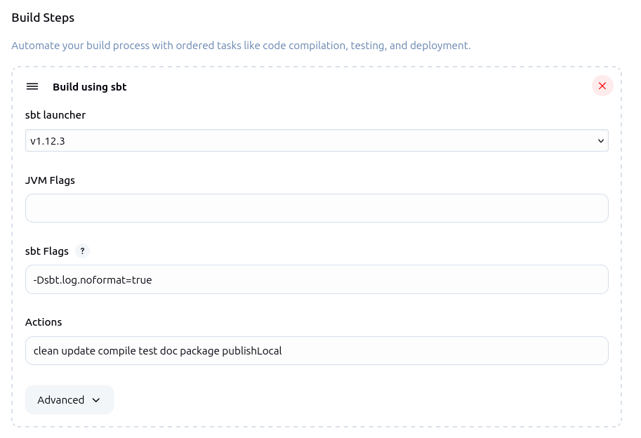

sbt plugin
==========

About
-----
This plugin allows building [Scala] projects in [Jenkins] using [sbt].

For more information about this plugin please visit the Jenkins [plugins] page.

Issues
------
Please [report] issues at the project's [Jira], using the component `sbt-plugin` in the issue.

## Configure the sbt plugin

-   In order to set up sbt-plugin, you need to specify the names and
    locations of one or more sbt installations. Press the **Manage
    Jenkins** link and then the **Tools**. You
    should now see the sbt configuration section where you will be asked
    to specify names and locations for your sbt launch jars.

## Configure your project to use sbt

-   Open your project configuration and add a **Build using sbt** build step

-   Now, choose which sbt installation to use, add any jvm and sbt flags you
    need for your build, and specify which actions you want to run. Keep
    the **-Dsbt.log.noformat=true** sbt flag to keep the console output
    clean.

-   Once you saved the project configuration, you can run your project
    and watch the virtual console to see the magical sbt work.

[Scala]: https://www.scala-lang.org/
[Jenkins]: https://www.jenkins.io/
[sbt]: https://github.com/sbt/sbt/
[plugins]: https://plugins.jenkins.io/sbt/
[report]: https://www.jenkins.io/participate/report-issue/redirect/#15775/sbt
[Jira]: https://issues.jenkins.io/issues/?jql=resolution%20is%20EMPTY%20and%20component%3D15775
